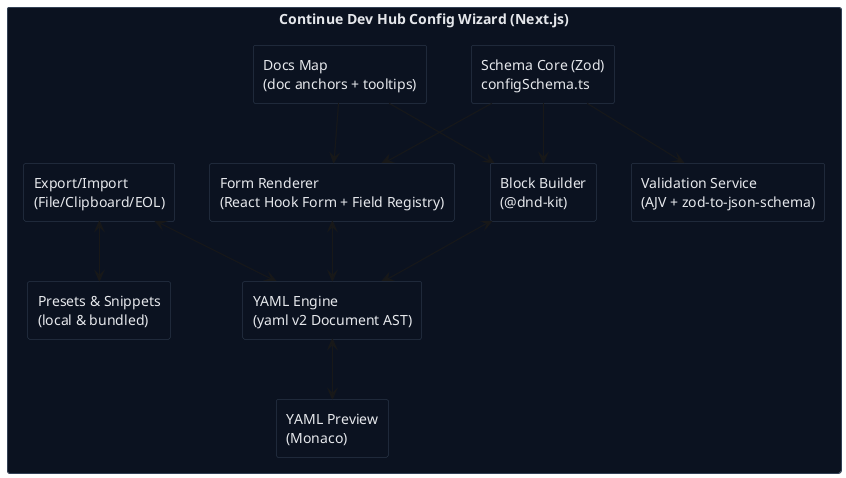

# SPEC-1-Continue Dev Hub Configuration Wizard

## Background

Authoring teams at organizations use Continue Dev Hub to publish reusable AI assistants (configs, models, rules, prompts, and MCP tools). Today, building a correct `config.yaml` requires manually cross‑referencing docs and examples. Mistakes (unknown keys, deprecated providers, wrong roles/capabilities) cause runtime issues in IDE/CLI. A schema‑driven, UI‑first wizard with live YAML and import/export will reduce errors, speed onboarding, and make configs maintainable as docs evolve.

## Requirements

**Must‑have (M)**
- **Schema coverage**: Support every non‑deprecated option from the `config.yaml` spec: `name`, `version`, `schema`, `models`, `context`, `rules`, `prompts`, `docs`, `mcpServers`, `data`.
- **Two authoring modes**:
  - **Form mode**: grouped fields, search/filter, inline tooltips, examples, defaults, validation.
  - **Block mode**: left palette of draggable blocks (models, prompts, rules, context providers, MCP servers, docs, data). Assemble into a full config.
- **Live YAML preview**: realtime, synchronized with either mode.
- **Round‑trip import**: load YAML → populate UI → validate → edit; flag unknown/deprecated keys; suggest replacements.
- **Export**: download file, copy to clipboard, choose filename and line endings (LF/CRLF).
- **Validation**: types, required fields, enums, ranges, cross‑field rules; human‑readable errors that deep‑link to docs.
- **Presets**: curated templates (single‑provider, multi‑provider, local/Ollama) + user‑saved custom snippets/blocks.
- **Advanced**: environment placeholders (`${VAR}`) & secret mapping (`${{ secrets.KEY }}`); conditional UI (options appear only when relevant); a **single source of truth** for the schema.
- **Accessibility**: WCAG 2.1 AA, keyboard navigation, ARIA roles/labels, focus management for DnD.
- **Performance**: instant typing feedback; validation under 20 ms per change on modern laptops; virtualized long lists.
- **Quality**: unit tests for schema/validators; e2e tests for create/import/edit/export.

**Should‑have (S)**
- Preserve YAML anchors/aliases on import; warn when editing would break anchors.
- Snippet library with tags and quick‑insert in both modes.

**Could‑have (C)**
- Team collaboration: shareable links with preloaded YAML.
- Offline mode w/ localStorage autosave.

**Won’t‑have (W)**
- Support for deprecated context providers or `config.json` legacy fields in the UI (we only show migration hints).

## Method

### A. Information Architecture & UX Flows

**Top‑level layout**
- Header: Config name/version/schema + actions (Import, Export, Presets, Docs, Settings).
- Left rail (toggle): **Blocks** (Block mode) / **Outline** (Form mode section tree).
- Main area: Form editor or Canvas builder.
- Right rail: **Live YAML** (Monaco editor) + **Validation panel**.

**Core flows**
1) **Create** → Pick a preset → Edit in Form or Block mode → Validate → Export.
2) **Import** → Paste/Upload YAML → Parse & validate → Show issues → Edit → Export.
3) **Remix** → Insert blocks/snippets → Adjust → Export.

**Form mode groups** (mirrors schema):
- Project (name, version, schema)
- Models
- Context
- Rules
- Prompts
- Docs
- MCP Servers
- Data Destinations

**Block mode palette**
- Model, Prompt, Rule, Context Provider (built‑ins only), MCP Server, Docs Site, Data Destination, Group/Section, Comment.
- Drag to Canvas → property sheet opens in a side drawer; Canvas supports reorder, nest, duplicate, disable.

**Live YAML & round‑trip**
- Two‑way binding: Zod schema ←→ form state ←→ YAML AST. Conflicts resolved via precedence rules (UI edits overwrite AST nodes). Anchors/aliases preserved unless the edited subtree intersects anchor targets.

### B. Architecture (frontend‑only app)



**Key decisions**
- **Single source of truth**: a Zod schema defines structure, types, defaults, and cross‑field refinements. We generate a JSON Schema (AJV) for fast validation and a form metadata registry to drive UI.
- **YAML AST**: use `yaml` (eemeli) `Document` to preserve anchors/aliases/comments where possible.
- **Accessibility**: `@dnd-kit` keyboard sensor; Radix primitives via shadcn/ui; focus traps; ARIA.
- **Performance**: React Hook Form w/ controlled inputs only where necessary; debounced YAML sync; virtualized lists.

### C. Machine‑Readable Schema (Zod → JSON Schema)

> **Note**: Only non‑deprecated providers/options are included. Deprecated context providers are excluded; rules/prompt blocks support `uses:` indirection and local definitions.

```ts
// src/schema/configSchema.ts
import { z } from "zod";

// Common
export const Roles = z.enum(["chat","autocomplete","embed","rerank","edit","apply","summarize"]); // summarize currently unused but allowed
export const Capabilities = z.enum(["tool_use","image_input"]);

const CompletionOptions = z.object({
  contextLength: z.number().int().positive().optional(),
  maxTokens: z.number().int().positive().optional(),
  temperature: z.number().min(0).max(2).optional(),
  topP: z.number().min(0).max(1).optional(),
  topK: z.number().int().min(1).optional(),
  stop: z.array(z.string()).optional(),
  reasoning: z.boolean().optional(),
  reasoningBudgetTokens: z.number().int().positive().optional(),
}).strict();

const RequestOptions = z.object({
  timeout: z.number().int().positive().optional(),
  verifySsl: z.boolean().optional(),
  caBundlePath: z.string().optional(),
  proxy: z.string().url().optional(),
  headers: z.record(z.any()).optional(),
  extraBodyProperties: z.record(z.any()).optional(),
  noProxy: z.array(z.string()).optional(),
  clientCertificate: z.object({
    cert: z.string(),
    key: z.string(),
    passphrase: z.string().optional(),
  }).optional(),
}).strict();

const EmbedOptions = z.object({
  maxChunkSize: z.number().int().min(128).optional(),
  maxBatchSize: z.number().int().min(1).optional(),
}).strict();

const AutocompleteOptions = z.object({
  disable: z.boolean().optional(),
  maxPromptTokens: z.number().int().positive().optional(),
  debounceDelay: z.number().int().min(0).optional(),
  modelTimeout: z.number().int().min(0).optional(),
  maxSuffixPercentage: z.number().min(0).max(1).optional(),
  prefixPercentage: z.number().min(0).max(1).optional(),
  transform: z.boolean().optional(),
  template: z.string().optional(),
  onlyMyCode: z.boolean().optional(),
  useCache: z.boolean().optional(),
  useImports: z.boolean().optional(),
  useRecentlyEdited: z.boolean().optional(),
  useRecentlyOpened: z.boolean().optional(),
}).strict();

const ChatOptions = z.object({
  baseSystemMessage: z.string().optional(),
  baseAgentSystemMessage: z.string().optional(),
  basePlanSystemMessage: z.string().optional(),
}).strict();

// Model (explicit)
const ExplicitModel = z.object({
  name: z.string(),
  provider: z.string(),
  model: z.string(),
  apiBase: z.string().url().optional(),
  // Provider-specific conveniences
  apiKey: z.string().optional(),
  useLegacyCompletionsEndpoint: z.boolean().optional(),
  roles: z.array(Roles).default(["chat","edit","apply","summarize"]).optional(),
  capabilities: z.array(Capabilities).optional(),
  maxStopWords: z.number().int().min(0).optional(),
  promptTemplates: z.object({ chat: z.string().optional(), edit: z.string().optional(), apply: z.string().optional(), autocomplete: z.string().optional() }).partial().optional(),
  chatOptions: ChatOptions.optional(),
  embedOptions: EmbedOptions.optional(),
  defaultCompletionOptions: CompletionOptions.optional(),
  requestOptions: RequestOptions.optional(),
  autocompleteOptions: AutocompleteOptions.optional(),
}).strict();

// Model (reusable block reference)
const ReferencedModel = z.object({
  uses: z.string(), // e.g., "anthropic/claude-3.5-sonnet"
  with: z.record(z.any()).optional(), // secrets & inputs mapping
  override: ExplicitModel.partial().optional(),
}).strict();

export const ModelItem = z.union([ExplicitModel, ReferencedModel]);

// Context provider (built-ins only)
export const BuiltInContextProvider = z.enum([
  "file","code","diff","http","terminal","open","clipboard","tree","problems","debugger","repo-map","currentFile","os"
]);

export const ContextItem = z.object({
  provider: BuiltInContextProvider,
  name: z.string().optional(),
  params: z.record(z.any()).optional(),
}).strict();

// Rules: either inline strings or hub/local references via uses
const RuleInline = z.string();
const RuleRef = z.object({ uses: z.string() }).strict();
export const RuleItem = z.union([RuleInline, RuleRef]);

// Prompts: inline or reference
export const PromptInline = z.object({
  name: z.string(),
  description: z.string().optional(),
  prompt: z.string(),
  invokable: z.boolean().optional(),
}).strict();
const PromptRef = z.object({ uses: z.string() }).strict();
export const PromptItem = z.union([PromptInline, PromptRef]);

// Docs sites
export const DocsItem = z.object({
  name: z.string(),
  startUrl: z.string().url(),
  favicon: z.string().url().optional(),
  useLocalCrawling: z.boolean().optional(),
}).strict();

// MCP servers
export const McpServer = z.object({
  name: z.string(),
  command: z.string(),
  args: z.array(z.string()).optional(),
  env: z.record(z.string()).optional(),
  cwd: z.string().optional(),
  requestOptions: RequestOptions.optional(),
  connectionTimeout: z.number().int().positive().optional(),
}).strict();

// Development data destinations
export const DataItem = z.object({
  name: z.string(),
  destination: z.string(), // file:/// or https?://
  schema: z.enum(["0.1.0","0.2.0"]),
  events: z.array(z.string()).optional(),
  level: z.enum(["all","noCode"]).default("all").optional(),
  apiKey: z.string().optional(),
  requestOptions: RequestOptions.optional(),
}).strict().refine(v => v.destination.startsWith("file://") || /^https?:\/\//.test(v.destination), {
  message: "destination must be file:///... or http(s)://...",
  path: ["destination"],
});

export const ConfigSchema = z.object({
  name: z.string().min(1),
  version: z.union([z.string(), z.number()]),
  schema: z.literal("v1"),
  models: z.array(ModelItem).optional(),
  context: z.array(ContextItem).optional(),
  rules: z.array(RuleItem).optional(),
  prompts: z.array(PromptItem).optional(),
  docs: z.array(DocsItem).optional(),
  mcpServers: z.array(McpServer).optional(),
  data: z.array(DataItem).optional(),
}).strict();

export type Config = z.infer<typeof ConfigSchema>;
```

**Derived JSON Schema** (generated at build): `scripts/generate-json-schema.ts` uses `zod-to-json-schema` and writes `public/schema/config.schema.json`.

### D. Validation Rules & Cross‑Field Constraints

- `models[].roles` nonempty when provided. If includes `autocomplete` → show autocomplete options. If includes `embed` → show embed options.
- `capabilities` accepts only `tool_use`, `image_input`.
- `embedOptions.maxChunkSize ≥ 128` & `maxBatchSize ≥ 1`.
- `data.schema ∈ {0.1.0, 0.2.0}`; `level ∈ {all, noCode}`.
- `mcpServers.command` required; optional `connectionTimeout` > 0.
- Unknown keys on import → retained in the AST but surfaced as warnings with doc links; deprecated keys → error with suggested replacements.

### E. Deprecated → Replacement Guidance (UI only; not in schema)

- **Deprecated context providers**: `@Codebase`, `@Folder`, `@Docs`, `@Greptile`, `@Commits`, `@Discord`, `@Jira`, `@Gitlab Merge Request`, `@Google`, `@Database`, `@Issue`, `@Url`, `@Search`, `@Web`. Use built‑ins or MCP servers instead.
- **Legacy `config.json`**: top‑level `requestOptions`, `completionOptions`, `slashCommands`, `tabAutocompleteOptions`, `analytics`, `experimental`, `userToken` are not supported; use YAML equivalents or UI settings.

### F. Component List (key ones)

- **SchemaCore**: Zod schema + metadata (labels, help, examples, doc anchors).
- **FormRenderer**: auto‑generates sections from schema; field widgets: text, select (enum), number with ranges, string array (chips), key‑value map editor, code editor for prompts/rules.
- **BlockPalette** & **Canvas**: draggable blocks; keyboard sensors; ARIA `listbox`/`option` semantics.
- **YamlPreview**: Monaco editor; read‑only by default; toggle to edit; shows diagnostics from AJV.
- **ImportDialog**: paste/upload; strategy selector (`Preserve anchors` vs `Normalize`).
- **ExportDialog**: filename, EOL choice, copy/download.
- **PresetGallery** & **SnippetLibrary**.
- **DocTooltip**: hover to show description & link; `?` icons next to labels.

### G. Data Model for Blocks/Snippets

```ts
// src/types/blocks.ts
export type BlockType = "model"|"prompt"|"rule"|"context"|"mcp"|"docs"|"data"|"group"|"comment";
export interface BlockBase { id: string; type: BlockType; title: string; note?: string; }
export type BlockNode = BlockBase & { children?: BlockNode[]; payload?: unknown };
```

### H. Example Presets (bundled)

1) **Single provider (OpenRouter chat + Codestral autocomplete)**
```yaml
name: Single Provider Starter (OpenRouter + Codestral)
version: 0.0.1
schema: v1
models:
  - name: Chat via OpenRouter
    provider: openrouter
    model: <MODEL_ID> # e.g., openai/gpt-4o or other OpenRouter route
    apiBase: https://openrouter.ai/api/v1
    apiKey: ${OPENROUTER_API_KEY}
    roles: [chat, edit, apply]
    # Add tool_use if your chosen OpenRouter model needs explicit enabling
    # per docs: capabilities can be added for proxies
    # capabilities: [tool_use]
  - name: Codestral Autocomplete
    provider: mistral
    model: codestral-latest
    apiBase: https://codestral.mistral.ai/v1
    apiKey: ${CODESTRAL_API_KEY}
    roles: [autocomplete]
    autocompleteOptions:
      debounceDelay: 250
      maxPromptTokens: 1024
context: [ { provider: file }, { provider: code }, { provider: diff } ]
```yaml
name: Single Provider Starter
version: 0.0.1
schema: v1
models:
  - name: GPT-4o
    provider: openai
    model: gpt-4o
    roles: [chat, edit, apply]
  - name: Codestral
    provider: mistral
    model: codestral-latest
    roles: [autocomplete]
    autocompleteOptions:
      debounceDelay: 250
      maxPromptTokens: 1024
context: [ { provider: file }, { provider: code }, { provider: diff } ]
```

2) **Multi‑provider w/ reranker + embeddings**
```yaml
name: Multi Provider Starter
version: 0.0.1
schema: v1
models:
  - name: GPT-4o
    provider: openai
    model: gpt-4o
    roles: [chat, edit, apply]
  - name: Voyage Reranker
    provider: voyage
    model: rerank-2
    roles: [rerank]
  - name: text-embed
    provider: openai
    model: text-embedding-3-large
    roles: [embed]
```

3) **Local models (Ollama)**
```yaml
name: Local Models Starter
version: 0.0.1
schema: v1
models:
  - name: Qwen2.5 Coder (Ollama)
    provider: ollama
    model: qwen2.5-coder:1.5b
    roles: [autocomplete]
  - name: Llama 3.1 (Ollama)
    provider: ollama
    model: llama3.1
    roles: [chat, edit]
```

### I. Visual Design & Tokens

- **Stack**: Next.js (App Router) + React 18/19‑ready, Tailwind + shadcn/ui (Radix); icons via lucide-react.
- **Tokens**: typography scale `text-sm, base, lg, xl, 2xl`; radius `rounded-2xl`; spacing 8‑point; shadows `shadow-sm/md`; surfaces `bg-muted/foreground` aligned with continue.dev brand; prefers dark by default; high‑contrast mode toggle.

---

## Implementation

### Runbook (local & production)

**Local dev**
```bash
pnpm install
pnpm dev # http://localhost:3000
```

**Test**
```bash
pnpm test # Vitest
pnpm e2e  # Playwright
```

**Build**
```bash
pnpm build && pnpm start
```

**Generate JSON Schema**
```bash
pnpm gen:schema
```


### Tech stack
- **Runtime**: Next.js 15 + TypeScript
- **UI**: Tailwind, shadcn/ui (Radix), @dnd-kit/core, @dnd-kit/sortable
- **Editors**: `@monaco-editor/react`
- **Schema/validation**: Zod + zod-to-json-schema + AJV
- **YAML**: `yaml` v2 (`Document` AST)
- **State**: React Hook Form + Zustand for cross‑panel state
- **Testing**: Vitest (unit) + Playwright (e2e)

### Project structure

```
continue-config-wizard/
├─ app/
│  ├─ layout.tsx
│  ├─ page.tsx
│  ├─ (wizard)/
│  │  ├─ form/page.tsx
│  │  └─ blocks/page.tsx
│  └─ api/
│     └─ validate/route.ts (optional server validation)
├─ src/
│  ├─ schema/configSchema.ts
│  ├─ schema/docsMap.ts (anchors + help text)
│  ├─ components/
│  │  ├─ FormRenderer.tsx
│  │  ├─ BlockPalette.tsx
│  │  ├─ Canvas.tsx
│  │  ├─ YamlPreview.tsx
│  │  ├─ ImportDialog.tsx
│  │  ├─ ExportDialog.tsx
│  │  ├─ PresetGallery.tsx
│  │  ├─ SnippetLibrary.tsx
│  │  └─ DocTooltip.tsx
│  ├─ lib/
│  │  ├─ yaml.ts (parse/print, anchors policy)
│  │  ├─ validation.ts (AJV wrapper)
│  │  └─ schemaAdapter.ts (Zod→UI metadata)
│  ├─ state/
│  │  └─ configStore.ts
│  └─ tests/
│     ├─ schema.spec.ts
│     ├─ fixtures/
│     │  ├─ valid/*.yaml
│     │  └─ invalid/*.yaml
│     └─ e2e/*.spec.ts
├─ public/schema/config.schema.json (generated)
├─ scripts/generate-json-schema.ts
├─ tailwind.config.ts
├─ shadcn.json
├─ package.json
└─ README.md
```

### Key code scaffolding

```tsx
// src/components/YamlPreview.tsx
import { useEffect } from "react";
import Editor from "@monaco-editor/react";
import { useConfigStore } from "@/state/configStore";

export default function YamlPreview(){
  const { yamlText, setYamlText, diagnostics } = useConfigStore();
  return (
    <div className="h-full border rounded-2xl">
      <Editor
        height="100%"
        defaultLanguage="yaml"
        value={yamlText}
        onChange={(v)=> setYamlText(v ?? "")}
        options={{ readOnly: false, minimap: { enabled:false }, fontSize: 13 }}
      />
      {/* diagnostics rendered as list with doc links */}
    </div>
  );
}
```

```ts
// src/lib/yaml.ts
import YAML, { Document } from "yaml";
export function parseYaml(text: string){
  const doc = YAML.parseDocument(text, { keepSourceTokens: true });
  return { doc, json: doc.toJS({}) };
}
export function stringifyYaml(json: unknown, base?: Document){
  // If base provided, update nodes to preserve anchors/comments where possible
  const doc = base ?? new YAML.Document();
  doc.contents = json as any;
  return doc.toString({ lineWidth: 0 });
}
```

```ts
// src/lib/validation.ts
import Ajv from "ajv"; import addFormats from "ajv-formats";
import schema from "../../public/schema/config.schema.json";
const ajv = new Ajv({ allErrors:true, allowUnionTypes:true }); addFormats(ajv);
export const validateConfig = ajv.compile(schema);
```

```tsx
// src/components/FormRenderer.tsx (snippet)
// Renders from a field registry derived from Zod
```

### Conditional UI examples
- `models[].roles` contains `autocomplete` → show Autocomplete section.
- Provider = `openai` → show `useLegacyCompletionsEndpoint` & `apiBase` help.
- Context provider = `http` → show `url`, `headers`, preview of request/response shape.
- Data destination starts with `file://` → show write test button; if `http` → show `POST` preview & `Authorization` helper.

### Docs mapping (tooltips)
- `docsMap.ts` contains `{ path: "models.defaultCompletionOptions.temperature", label, description, example, docHref }` so tooltips and error links resolve.

### Import pipeline
1. Parse YAML → JSON + AST
2. Validate JSON structurally
3. Diff JSON vs schema → warnings for unknown/deprecated keys
4. Build UI state tree
5. Preserve raw AST for anchors; edits update both UI state & AST
6. **Default policy: Strict anchor preservation**. UI blocks edits that would break referenced anchors/aliases. User can explicitly switch to Normalize mode in Import dialog.

### Export pipeline
- Re‑validate
- Choose EOL (LF/CRLF)
- Write `config.yaml` filename selected by user
- Copy to clipboard (optional)

### Sample fixtures

**valid/minimal.yaml**
```yaml
name: Minimal
version: 0.0.1
schema: v1
```

**valid/complete.yaml**
```yaml
name: Complete
version: 1.2.3
schema: v1
models:
  - name: GPT-4o
    provider: openai
    model: gpt-4o
    roles: [chat, edit, apply]
    defaultCompletionOptions:
      temperature: 0.7
  - uses: anthropic/claude-3.5-sonnet
    with:
      ANTHROPIC_API_KEY: ${{ secrets.ANTHROPIC_API_KEY }}
    override:
      roles: [chat]
context:
  - provider: file
  - provider: code
rules:
  - Always be concise
  - uses: sanity/sanity-opinionated
prompts:
  - name: check
    description: Check code for mistakes
    invokable: true
    prompt: |
      Please review the selected code and point out clear errors.
docs:
  - name: Continue
    startUrl: https://docs.continue.dev/intro
mcpServers:
  - name: sqlite
    command: uvx
    args: [mcp-server-sqlite, --db-path, /tmp/test.db]
data:
  - name: Local Dev Data
    destination: file:///Users/me/.continue/dev_data
    schema: 0.2.0
    level: all
```

**invalid/unknown-key.yaml**
```yaml
name: Oops
version: 0.0.1
schema: v1
fooBar: true  # unknown key → warning
models:
  - name: bad
    provider: openai
    model: gpt-4o
    capabilities: [tool_use, image_outputs] # image_outputs is invalid → error
```

## Milestones

1. **M0 – Schema foundation (Week 1)**: Zod schema + JSON Schema generation; fixtures; unit tests.
2. **M1 – YAML engine & preview (Week 2)**: AST parser/stringifier; live preview; import/export.
3. **M2 – Form mode (Week 3)**: Form renderer with 80% coverage; validation panel.
4. **M3 – Block mode (Week 4)**: Palette, Canvas, keyboard DnD; property drawer.
5. **M4 – Presets & snippets (Week 5)**: Gallery; save/load; search.
6. **M5 – Accessibility & perf polish (Week 6)**: WCAG AA audit; virtualization; profiling.
7. **M6 – E2E & docs (Week 7)**: Playwright flows; README; packaged build.

## Gathering Results

- **Acceptance tests**:
  - Form vs Block parity → identical YAML for same inputs.
  - Round‑trip import/export is semantically equivalent.
  - Unknown/deprecated keys flagged with doc links; no deprecated items present in UI/output.
  - Presets render valid, runnable configs in IDE.
- **Metrics**: time to first valid export; number of validation errors per session; import success rate; a11y audits passing.

## Need Professional Help in Developing Your Architecture?

Please contact me at [sammuti.com](https://sammuti.com) :)

